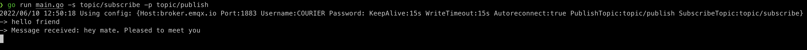

# Sample App

A sample command line app is added [here][2] which makes Courier connection with a [EMQX][1] public broker. It demonstrates multiple functionalities of Courier Go library like Connect, Disconnect, Publish, Subscribe and Unsubscribe.
You can modify the conf.yaml file to update any of the configurable option.

## Running sample app

- Clone the project from [GitHub](https://github.com/gojek/courier)
- Run command `go run main.go -s <subscription_topic> -p <publish_topic>` from inside `example-go`

[1]: broker.emqx.io
[2]: https://github.com/gojek/courier/example-go